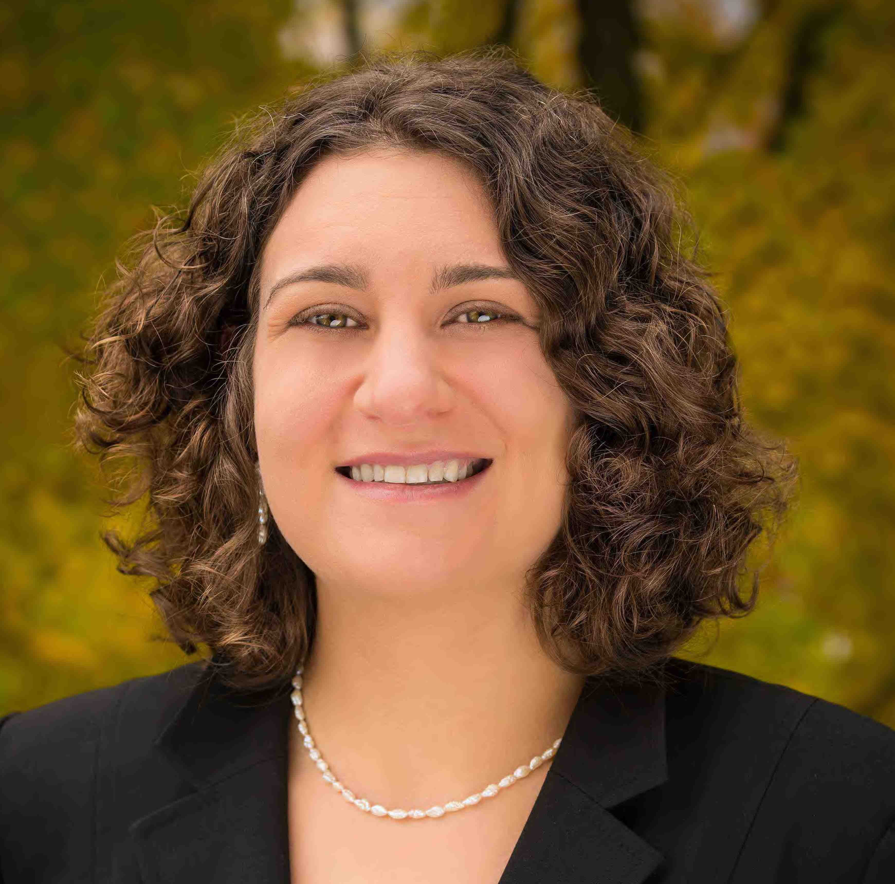

# BioC Asia 2019

5-6 December, 2019  
Charles Perkins Centre, Camperdown Campus of University of Sydney, NSW, Australia

## General Information

This year a large portion of the BioC Asia conference will be shared with AMSI's
[BioInfoSummer](https://bis.amsi.org.au/). 

Note that the annual [ABACBS conference](https://www.abacbs.org/conference2019/about),
this year joined with GIW, will be held the following week (9-11 of December) in Sydney.

## Registration

Registration for BioC Asia is \$60 for both days for students and \$120 for anyone else.

*Note that registration has closed.*

## Location

The conference will be held at the [Charles Perkins Centre](https://sydney.edu.au/charles-perkins-centre/):

John Hopkins Drive, 
The University of Sydney,
Sydney, NSW 2006

## Keynote Speakers

We are pleased to annouce three international keynote speakers:

  

**Helena Crowell**: Helena earned her undergraduate degree at the Univeristy of Heidelberg in 
Biochemistry. She then went on to earn her Master's degree in Computational Biology & Bioinformatics 
at the ETH Zurich. She is currently a PhD candidate in Statistical Bioinformatics at the University of
Zurich.

Helena focuses on developing analysis frameworks for CyTOF data and differential discovery in scRNA-seq data. She is the author of a popular Bioconductor package providing tools for preprocessing and analysis of cytometry data.

   

**Martin Morgan**: Martin earned his undergraduate and Master's degrees in Botany at the University of Toronto. Martin's PhD studies at the University of Chicago involved the evolutionary consequences of frequency-dependent selection, and of multilocus deleterious mutation. Martin is currently at the Roswell Park Comprehensive Cancer Center in Buffalo.

Martin leads the core team that maintains the Bioconductor project. He is the author of many Bioconductor packages and a renowned biostatistican.

  

**Elana Fertig**: Elana is an Associate Professor of Oncology at Johns Hopkins University. Prior to entering the field of computational cancer biology, Elana was a NASA research fellow in numerical weather prediction. 

Elana runs a hybrid computational and experimental lab in the systems biology of cancer and therapeutic response. Her computational methods blend mathematical modeling and artificial intelligence to determine the biomarkers and molecular mechanisms of therapeutic resistance from multi-platform genomics data. 

## Invited Speakers

**Joshua Ho**, The University of Hong Kong

**John Marioni**, The University of Cambridge

**Shila Ghazanfar**, The University of Cambridge

## Presentations

The conference will feature selected talks (15mins), lightning talks (5mins), and software demos (5mins).

*Abstract submission has closed.*

## Workshops

There will be 9 workshops to be held on Thursday
and Friday. Participants can elect to attend 3. 

*Abstract submission has closed.*

All workshops are open to BioInfoSummer participants. For 
the workshops please note that:

- All participants are expected to bring their own laptops
- All participants are expected to have followed the installation instructions 
- WiFi access will be through either eduroam or using a login
- Access to power sockets will be available so please bring your power adapter
- Please ensure you are running a current browser (i.e. chrome, firefox etc)

## Travel Awards

There will be a number of travel awards available, with priority given to support students and early career researchers.
You must submit an abstract for a talk, software demo, or workshop to be eligible for a travel award.

*Travel award applications have closed.*

## Thursday: 5 December, 2019

Bioconductor Workshops are in Seminar Room 1.1

### Provisional Timetable

| Time | |
|:--------------- |:----------------------------- |
| 8:45am - 9:00am | Registration   |
| 9:00am - 9:30am | Bioconductor update |
| 9:30am - 10:15am | [Computational challenges in single cell genomics and applications in early development](abstracts/marioni.html)   John Marioni - invited speaker |
| 10:15am - 10:20am | [A gene orientated approach to analysis of Hi-C data from immune cells](abstracts/coughlan.html)   Hannah Coughlan |
| 10:20am - 10:25am | [A workshop on single-cell RNA-seq analysis](abstracts/qiao.html)   PuXue Qiao |
| 10:25am - 10:30am | [Seamless visualization of complex genomic variations in GMOs and edited cell lines using gmoviz](abstracts/zeglinski.html)   Kathleen Zeglinski |
| 10:30am - 11:00am | **Morning Tea**   (Provided) |
| 11:00am - 11:15am | [Use R/Bioconductor for Nanopore RNA-seq data analysis](abstracts/dong.html)   Xueyi Dong |
| 11:15am - 11:30am | [topconfects: rank differentially expressed genes using confidence bounds on fold change, with multiple testing adjustment](abstracts/harrison.html)   Paul Harrison |
| 11:30am - 11:35am | [Network-based Classification with ClassifyR](abstracts/strbenac.html)   Dario Strbenac |
| 11:35am - 11:40am | [Modelling for heteroscedastic groups in RNA-seq data](abstracts/law.html)   Charity Law |
| 11:40 - 11:45am | Buffer time |
| 11:45am - 12:15pm | [Visualisation and analysis of circular RNAs using Ularcirc](abstracts/ho.html)   Joshua Ho - invited speaker |
| 12:15pm - 1:30pm | **Lunch**  | 
| 1:30pm - 3:00pm | Bioinformatics Workshop Stream A: Pei Wang - Imputation and data quality control for proteomics data ([description](workshops/workshop_wang.html), [materials]())   Bioinformatics Workshop Stream B: Pengyi Yang - Computational analysis for biological discovery from (phospho)proteomic data  ([description](workshops/workshop_yang.html), [materials]())  **Bioconductor Workshop: Martin Morgan - R and Bioconductor for Genomic Analysis**  ([description](workshops/workshop_morgan.html), [materials]()) | 
| 3:00pm - 3:30pm | **Afternoon Tea**   (Provided) | |
| 3:30pm - 4:30pm | Bioinformatics Workshop Stream A: Pei Wang - Imputation and data quality control for proteomics data  ([description](workshops/workshop_wang.html), [materials]())   Bioinformatics Workshop Stream B: Ben Crossett, David Maltby & Angela Connolly - Introduction to proteomics  ([description](workshops/workshop_crossett_maltby_connolly.html), [materials]())   **Bioconductor Workshop: Peter Hickey & Saskia Freytag - Building a Bioconductor package**  ([description](workshops/workshop_hickey_freytag.html), [materials]()) |
| 4:30pm - 5:00pm | [Investigating higher order interactions in single cell data with scHOT](abstracts/ghazanfar.html)   Shila Ghazanfar - invited talk|
| 5:00pm - 5:15pm | [Integration of multiple single-cell CyTOF datasets to untangle the heterogeneity of cancer patients' responses to a new class of anti-cancer drugs](abstracts/trussart.html)   Marie Trussart |
| 5:15pm - 5:30pm | [Gene Set Testing for Differentially Methylated Regions](abstracts/maksimoovic.html)   Jovana Maksimovic |
| 5:30pm - 5:35pm | [A tidy wrapper suite that introduces a unifying grammar for single-cell and bulk transcriptomic analyses](abstracts/mangiola.html)   Stefano Mangiola |
| 5:35pm - 5:40pm | [An Introduction to currently available scATAC-seq data analysing tools](abstracts/yang.html)   Haoyu Yang |
| 6:00pm - 7:30pm | [Public Lecture](https://bis.amsi.org.au/public-lecture/)   Rafael Irizarry | 
| 7:30pm - 9:00pm | Pub | 

## Friday: 6 December, 2019

Morning presentations are in The Hub, outside of Charles Perkins Centre main entry. Afternoon workshops in Dry Lab 1.1, Dry Lab 1.2 and Dry Lab 1.3.

### Provisional Timetable

| Time | |
|:--------------- |:----------------------------- |
| 8:45am - 9:00am | Registration   |
| 9:00am - 9:40am | [How to advance science using Bioconductor](https://bis.amsi.org.au/speakers/martin-morgan/)   Martin Morgan - keynote speaker |
| 9:40am - 9:55am | [The RNAseq123 workflow package in Bioconductor](abstracts/ritchie.html)   Matthew Ritchie |
| 9:55am - 10:10am | [ClinSV: Detection of clinically relevant structural and copy number variation from whole genome sequencing](abstracts/minoche.html)   Andre Minoche |
| 10:10am - 10:15am | [Experiences of a First-Time Package Contributor](abstracts/pederson.html)   Stephen Pederson |
| 10:15am - 10:20am | [schex avoids overplotting for large single cell RNA-sequencing datasets](abstracts/freytag.html)   Saskia Freytag |
| 10:20am - 10:25am | [COmapR: Genetic length calculation from crossover events](abstracts/lyu.html)   Ruqian Lyu |
| 10:25am - 10:30am | Buffer time |
| 10:30am - 11:00am | **Morning Tea**   (Provided) |
| 11:00am - 11:20pm | 	Single cell analysis with Mass Cytometry; technology introduction and opportunities in clinical studies   Helen McGuire - invited speaker |
| 11:20am - 12:00pm | [On differential discovery in high-dimensional cytometry data](https://bis.amsi.org.au/speakers/helena-crowell/)   Helena Crowell - keynote speaker |
| 12:00pm - 12:30pm | TBA |
| 12:30pm - 1:30pm | **Lunch**  | |
| 1:30pm - 3:30pm | **Bioconductor Workshop Stream A: Helena Crowell - Differential discovery in high-dimensional cytometry data**  ([description](workshops/workshop_crowell.html), [materials]())  **Bioconductor Workshop Stream B: Stuart Lee - Fluent genomics: a plyranges and tximeta case-study**  ([description](workshops/workshop_lee.html), [materials](https://bioconductor.github.io/BiocWorkshops/fluent-genomic-data-analysis-with-plyranges.html))   Bioinformatics Workshop: Dave Tang - Reproducible bioinformatics  ([description](workshops/workshop_tang.html), [materials](https://github.com/davetang/reproducible_bioinformatics))|
| 3:30pm - 3:50pm | **Afternoon Tea**   (Provided) | |
| 3:50pm - 4:45pm | [Defining immune signatures of therapeutic response with non-negative matrix factorization of bulk and single cell data](https://bis.amsi.org.au/speakers/elana-fertig/)   Elana Fertig - keynote speaker |
| 4:45pm - 5:00pm | **Closing Remarks** |

## Contact

### In Case of Questions

If you have any questions regarding the conference please email Peter via
hickey@wehi.edu.au.

### Conference Committee

* Peter Hickey, The Walter and Eliza Hall Institute
* Saskia Freytag, The Harry Perkins Institute
* Dario Strbenac, University of Sydney
* Stephen Pederson, University of Adelaide
