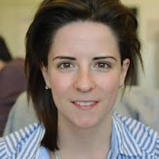
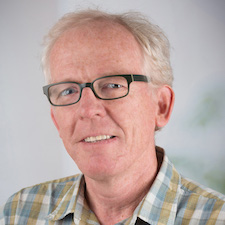

# BioC Asia 2019

5-6 December, 2019  
Charles Perkins Center, Sydney, NSW, Australia  

## General Information

This year a large portion of the BioC Asia conference will be shared with AMSI's
[BioInfoSummer](https://bis.amsi.org.au/). 

Note that the annual [ABACBS conference](https://www.abacbs.org/conference2019/about),
this year joined with GIW, will be held the following week (9-11 of December) in Sydney.

## Location

The conference will be held at the [Charles Perkins Center](https://sydney.edu.au/charles-perkins-centre/):

John Hopkins Drive, 
The University of Sydney,
Sydney, NSW 2006

## Keynote Speakers

We are pleased to annouce two international keynote speakers:

  
   

&nbsp; &nbsp; &nbsp; &nbsp; &nbsp; &nbsp;  **Helena Crowell**  &nbsp;&nbsp;&nbsp;&nbsp;&nbsp;&nbsp;&nbsp;&nbsp;&nbsp;&nbsp;&nbsp;&nbsp;&nbsp;&nbsp;&nbsp;
&nbsp;&nbsp;&nbsp;&nbsp;&nbsp;&nbsp;&nbsp;&nbsp;&nbsp;&nbsp;&nbsp;&nbsp;&nbsp;&nbsp;
&nbsp;&nbsp;&nbsp;&nbsp;&nbsp;&nbsp;&nbsp;&nbsp;**Martin Morgan**

**Helena Crowell**: Helena earned her undergraduate degree at the Univeristy of Heidelberg in 
Biochemistry. She then went on to earn her Master's degree in Computational Biology & Bioinformatics 
at the ETH Zurich. She is currently a PhD candidate in Statistical Bioinformatics at the University of
Zurich.

Helena focuses on developing analysis frameworks for CyTOF data and differential discovery in scRNA-seq data. She is the author of a popular Bioconductor package providing tools for preprocessing and analysis of cytometry data.

**Martin Morgan**: Martin earned his undergraduate and Master's degrees in Botany at the University of Toronto. Martin's PhD studies at the University of Chicago involved the evolutionary consequences of frequency-dependent selection, and of multilocus deleterious mutation. Martin is currently at the Roswell Park Comprehensive Cancer Center in Buffalo.

Martin leads the core team that maintains the Bioconductor project. He is the author of many Bioconductor packages and a renowned biostatistican.

## Invited Speakers

TBC

## Presentations

The conference will feature selected talks (15mins), lightning talks (5mins), and software demos (5mins).
Abstract submission is now open and will close on September 20 (11:59PM AEST).

- Submit an abstract for a lightning talk, software demo, or selected talk [here](https://docs.google.com/forms/d/e/1FAIpQLScr9cwCXeMhjvixh38u2H84Xa43ThDhrhuYLCH-BWuN5uFXJA/viewform?usp=sf_link).

## Workshops

There will be 6 workshops, 3 advanced and 3 intermediate, to be held on Thursday
and Friday afternoon.
Abstract submission is now open and will close on September 20 (11:59PM AEST).

- Submit an abstract for a workshop [here](https://docs.google.com/forms/d/e/1FAIpQLSceksMuiS7cGFv2Ms0B3hSx-QC8zuEfgEEbu51293Kv6o0xEQ/viewform?usp=sf_link).

All workshops are open to BioInfoSummer participants. For 
the workshops please note that:

- All participants are expected to bring their own laptops
- All participants are expected to have followed the installation instructions 
- WiFi access will be through either eduroam or using a login
- Access to power sockets will be available so please bring your power adapter
- Please ensure you are running a current browser (i.e. chrome, firefox etc)

## Travel Awards

There will be a number of travel awards available, with priority given to support students and early career researchers.
You must submit an abstract for a talk, software demo, or workshop to be eligible for a travel award.
Travel award applications are now open and will close on September 20 (11:59PM AEST).

- Submit an application for a travel award [here](https://docs.google.com/forms/d/e/1FAIpQLSdFR0c-eq5RLMeV0AtA4xTwqEeKp-trmhzEkdxdvKOCqnxfvg/viewform?usp=sf_link).

## Thursday: 5 December, 2019

### Provisional Timetable

| Time | Intermediate Stream | Advanced Stream |
|:--------------- |:----------------------------- |:----------------------------- |
| 8:45am - 9:00am | Registration   |
| 9:00am - 10:30am | Conference presentations   (1 invited talk, selected talks)|
| 10:30am - 11:00am | **Morning Tea**   (Provided) |
| 11:00am - 12:30pm | Conference presentations   (1 invited talk, selected talks)|
| 12:30pm - 1:30pm | **Lunch**  | |
| 1:30pm - 3:00pm | Workshop 1   (joined with BioinfoSummer) | Workshop 2   (joined with BioinfoSummer) |
| 3:00pm - 3:30pm | **Afternoon Tea**   (Provided) | |
| 3:30pm - 4:30pm | Workshop 3   (joined with BioinfoSummer) | Workshop 4   (joined with BioinfoSummer) |
| 4:30pm - 5:45pm | Conference presentations   (lightning talks)|
| 6:00pm - 7:30pm | Public Lecture   (joined with BioinfoSummer) | Pub   |

## Friday: 6 December, 2019

### Provisional Timetable

| Time | Intermediate Stream | Advanced Stream |
|:--------------- |:----------------------------- |:----------------------------- |
| 8:45am - 9:00am | Registration   |
| 9:00am - 10:30am | Conference presentations   (Martin Morgan, Elanie Fertig)|
| 10:30am - 11:00am | **Morning Tea**   (Provided) |
| 11:00am - 12:30pm | Conference presentations   (TBA, Simon Poon, software demos)|
| 12:30pm - 1:30pm | **Lunch**  | |
| 1:30pm - 3:30pm | Workshop 5   (joined with BioinfoSummer) | Workshop 6   (joined with BioinfoSummer) |
| 3:30pm - 3:50pm | **Afternoon Tea**   (Provided) | |
| 3:50pm - 4:45pm | Conference presentations   (Helena Crowell)|
| 4:45pm - 5:00pm | **Closing Remarks** |

