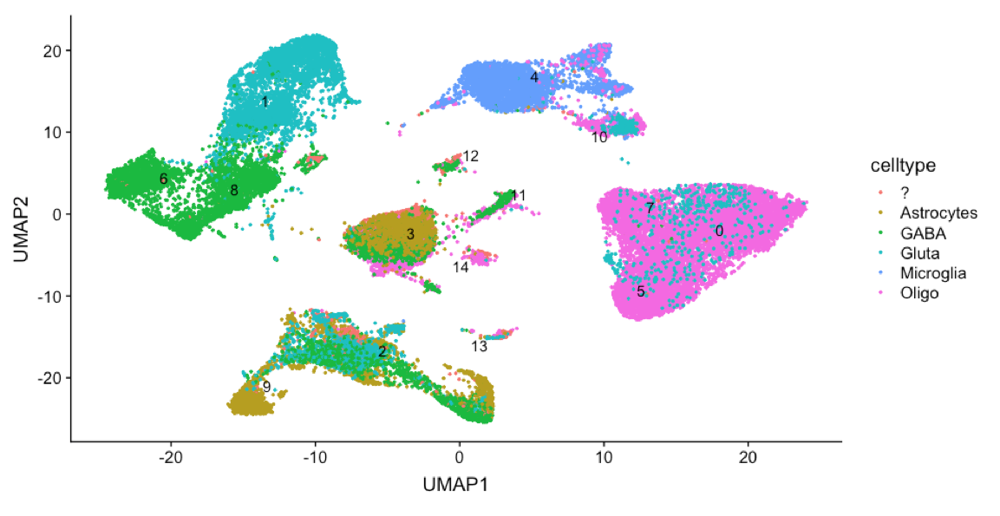

```{r setup, include=FALSE}
options(htmltools.dir.version = FALSE)
library(icon)
```


# workflow for analysis of scRNA-seq 


.center[
```{r, echo=FALSE}

```
]

---

class: center


```{r, echo=FALSE, out.width = "80%"}
knitr::include_graphics("BiocAsia_Pres_files/tween9.gif")
```

---

class: inverse, center, middle

# but what if the design is more complex?
## 😱💣💥 

---

# fcd - interrupted cortical development 

.center[
```{r, echo=FALSE,  out.width = "80%"}

```
]

---

# lesion centre contains more bizarre cells 

.center[
```{r, echo=FALSE,  out.width = "100%"}

```
]

---

# utilizing snRNA-seq to study bizarre cells 
.center[
```{r, echo=FALSE,  out.width = "100%"}

```
]

---
# requirements for a workflow 

.centre[
1. include multiple individuals

1. allow for heterogeneity between individuals

1. use centre and rim distinction

]

.centre[
```{r, echo=FALSE,  out.width = "50%"}

```
]

---
# a complex workflow

.centre[
```{r, echo=FALSE,  out.width = "100%"}

```
]

---

# a complex workflow requires many tools

.centre[
```{r, echo=FALSE,  out.width = "100%"}
knitr::include_graphics("BiocAsia_Pres_files/workflow2.png")
```
]

---

class: inverse, center, middle

# lessons learned
## 🎉😁

---

# filter together to preserve genes 

this is a bad idea, because it filters **exactly** the genes that we are interested in:

```{r eval=FALSE, include=TRUE}
sce_rim <- load_cellranger_matrix("rim")
sce_centre <- load_cellranger_matrix("centre")

# some conversion steps and other filtering

keep_rim <- nexprs(sce_rim, 
    byrow=TRUE) >= 0.01*dim(sce_rim)[1]
keep_centre <- nexprs(sce_rim, 
    byrow=TRUE) >= 0.01*dim(sce_centre)[1]

sce_rim <- sce_rim[keep_rim , ]
sce_centre <- sce_centre[keep_centre , ]
```

---

# filter together to preserve genes 

this is a better idea:

```{r eval=FALSE, include=TRUE}
sce_rim <- load_cellranger_matrix("rim")
sce_centre <- load_cellranger_matrix("centre")

counts <- as(cbind(exprs(sce_rim), exprs(sce_centre)), "matrix")
colnames(counts) <- c(gsub("-1", "-R", colnames(exprs(sce_rim))), 
      gsub("-1", "-C", colnames(exprs(sce_centre)))) 

colData <- rbind(as(phenoData(sce_rim), 'data.frame'), 
      as(phenoData(sce_centre), 'data.frame'))
rownames(colData) <- c(gsub("-1", "-R", colnames(exprs(sce_rim))),
      gsub("-1", "-C", colnames(exprs(sce_centre)))) 

sce <- SingleCellExperiment(assays = list(counts = counts),
      colData = colData, rowData=as(featureData(sce_rim), 
      'data.frame'))

#then filter
```

---

# mitochondrial content found in nuclei

.centre[
```{r, echo=FALSE,  out.width = "70%"}

```
]

**probably** not a revelation, but just remember

```{r eval=FALSE, include=TRUE}
rowData(sce)$Mito <- grepl("^MT-", rowData(sce)$symbol)
sce <- sce[! rowData(sce)$Mito , ]
```

---

# interactivity improves annotation

.centre[
```{r, echo=FALSE,  out.width = "80%"}

```
]

---
class: inverse, center, middle

# problems encountered
## 💔😡

---

# object conversions can be tricky

this mostly works

```{r eval=FALSE, include=TRUE}
seurat_data <- Seurat::Convert(sce, "seurat")
```

this often misses crucial information (after `Seurat` operations)

```{r eval=FALSE, include=TRUE}
sce <- Seurat::Convert(seurat_data, "SingleCellExperiment")
```

but a **solution** might be the `BioSeurat` 📦 

finally this produces sub-optimal results in monocle 3 alpha

```{r eval=FALSE, include=TRUE}
monocle_data <- scran::convertTo(sce, type="monocle")
```

convert manually by initializing new objects

---

background-image: url(https://media2.giphy.com/media/xT9KVmINRKGsIzd0YM/giphy.gif?cid=3640f6095bfe1b39435575775100bb6b)
background-position: 50% 50%
class: center, bottom, inverse

# python 🐍 for the win!

---

# for multiple datasets - python is 🗝

.centre[
```{r, echo=FALSE,  out.width = "80%"}

```
]

---

class: inverse, center, middle

# some results
## 💯🏆

---

# umap plot of all the data

.centre[
```{r, echo=FALSE,  out.width = "100%"}

```
]

---

# some separation by sample

.centre[
```{r, echo=FALSE,  out.width = "100%"}

```
]

---

# identifying bizarre cells

.centre[
```{r, echo=FALSE,  out.width = "100%"}

```
]

---

# marker genes indicate bizarre cells

.centre[
```{r, echo=FALSE,  out.width = "100%"}

```
]

---

# summary

* lots of work remains to be done, i.e. a living-breathing workflow
  * close collaboration helps improve workflow 

* currently no workflows to deal with snRNA-seq from multiple indviduals each with matched samples
  * cancer applications: tumour - normal matched samples 

* sometimes `r icon::fa_r_project()` is too slow in exploration stage
  * many iterations, more than 20,000 cells/nuclei


---

class: center, middle

# Thanks!

In particular to 👩🏼
🔬: Wei Shern Lee, Sarah Stephenson, Richard Leventer, Simon Harvey, Wriginia Maixner, Melanie Bahlo, Paul Lockhart, Brendan Ansell

And 🏢: WEHI, MCRI, RCH

## 🤷🎤
